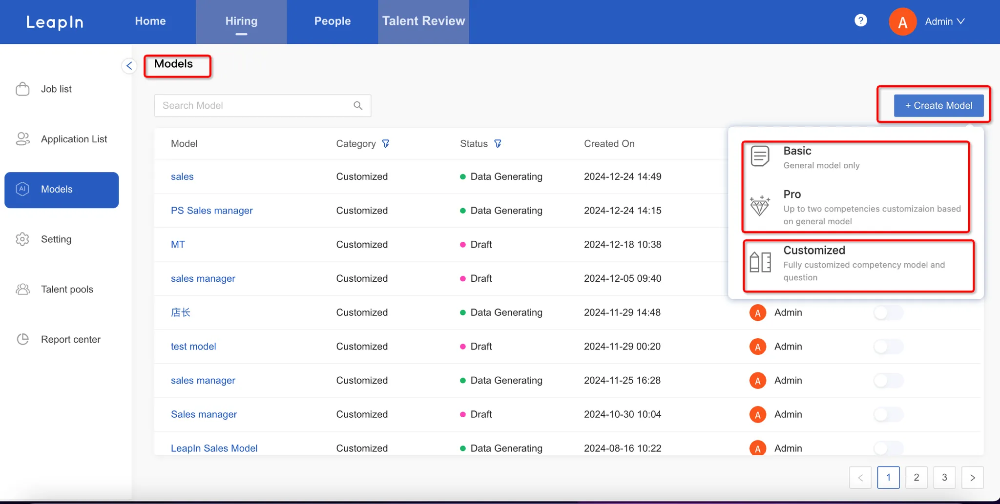
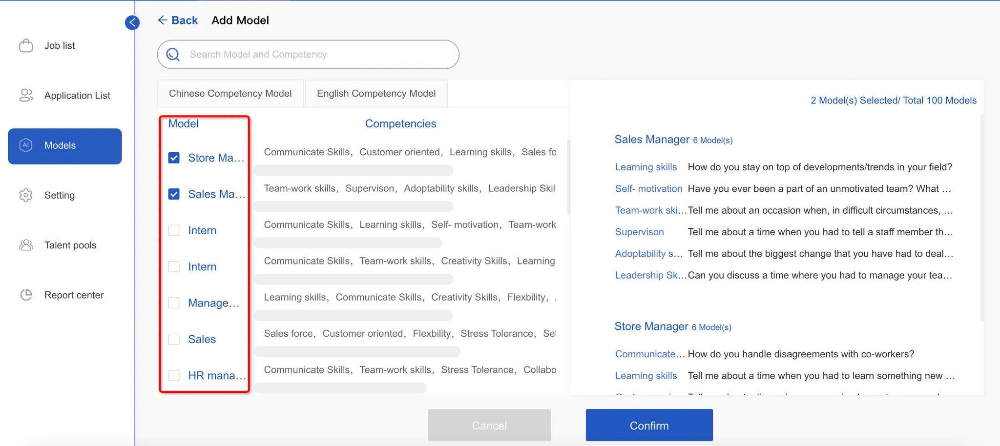
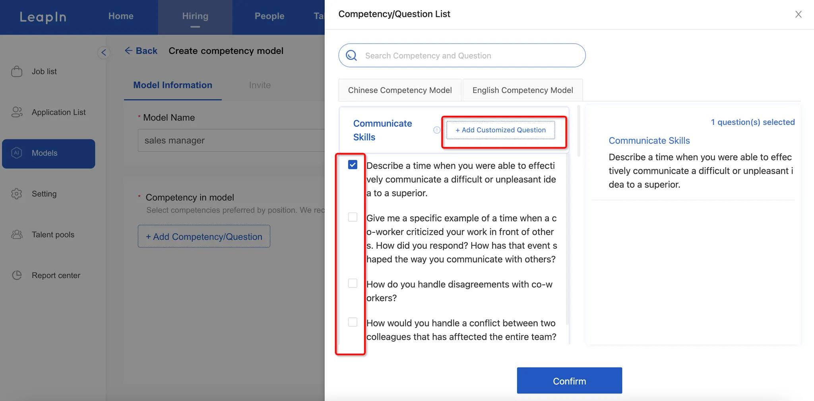

# Hiring - Models

To get started, head to the Model Management menu and click the "Add New Model" button in the upper right.

There are three ways to create a model:

1. Choose from our pre-built models in the question bank for instant deployment
2. Start with a template and customize the capabilities and questions to fit your needs
3. Build from scratch by naming your model and adding 4-6 custom questions

# Basic

Click on the Model Management menu, enter the model list, and click the [Add New Model] button in the top right corner

# Pro

Select a model, in the model details you can select and modify capabilities and questions, after editing click confirm to directly publish the model.

# Customize

Select a model, enter the model name, add/customize capabilities and questions, recommended 4-6 questions, click save.

## Invite Employee

Once your model is set up, you can invite participants by either manually entering their information or uploading a template. They'll receive an email invitation to record a video for the modeling process. You can also share the invitation link directly in group chats.

## Labelling

For the evaluation phase, simply add scorers to your different assessment groups. After all scoring is complete, just hit submit to begin the model training process.

