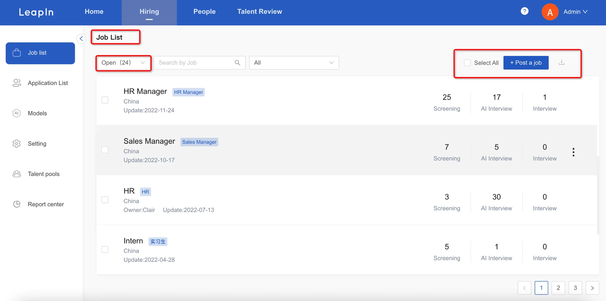
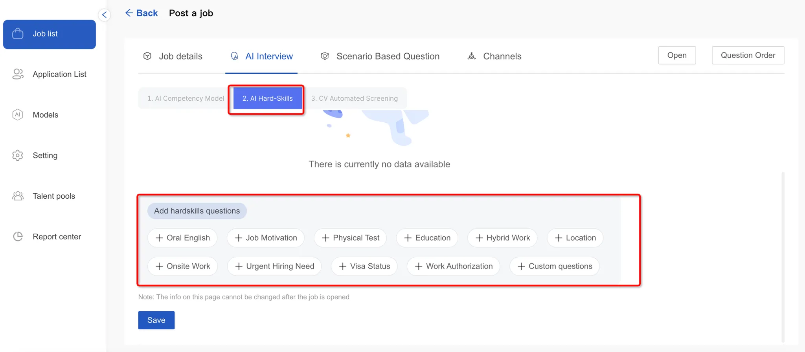

# Job List

To create a new position, navigate to the Job List menu and click the “Post a Job” button in the top right corner.

Start by entering the basic position details and save to continue

Next, configure the AI interview settings by choosing your AI capability model and clicking "Save" to move forward.

Then, set up AI hard skills - you can either generate these automatically with AI or add them manually. Save your changes to proceed to CV screening setup.

