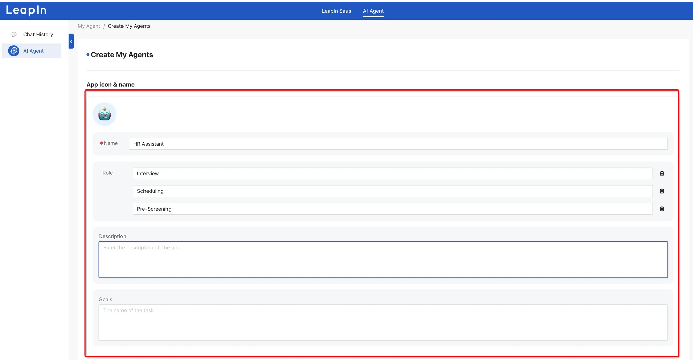
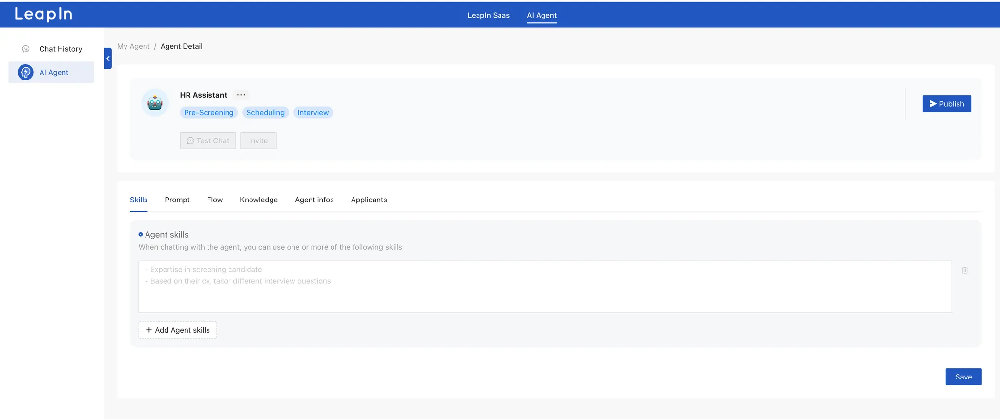
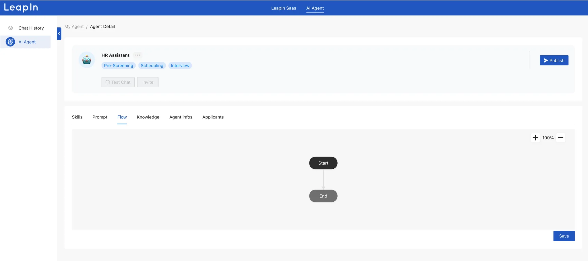
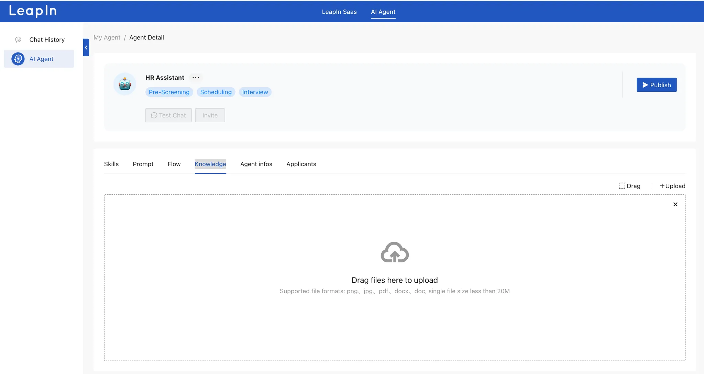
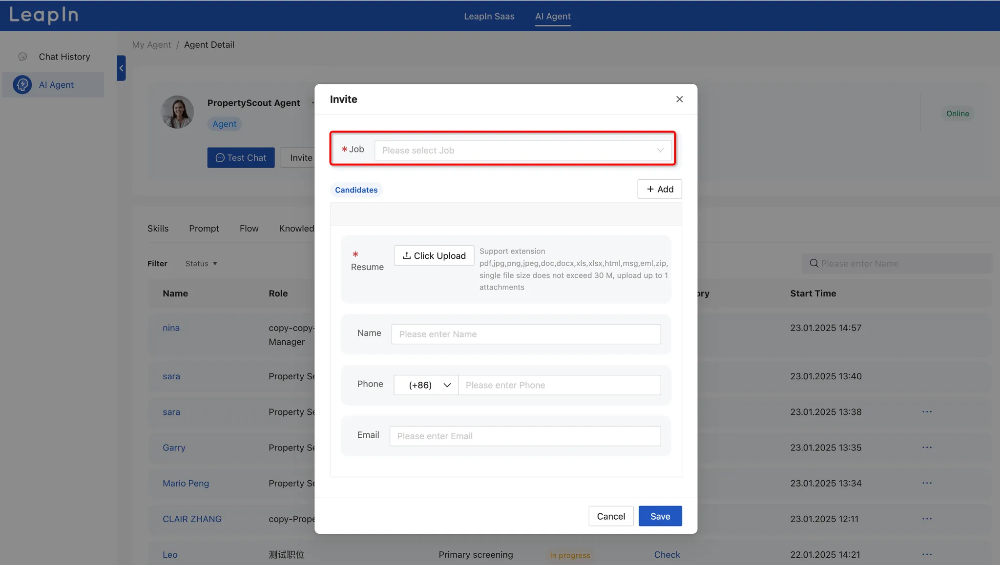

# AI Agent

Welcome to the AI Recruiting Agent platform that will transform your hiring process.

You've got two options: either pick an agent from the marketplace or build your own custom one.


To create your own agent, simply fill in the required information: give it a name, specify its role, and provide a detailed description of what you want the agent to do and its goals.



## Agent skills:

Specify the skills you want your agent to have



## **Prompt:**

A prompt is a set of instructions or guidelines that you provide to your AI agent to define how it should behave and respond. It's like giving your agent a specific script or playbook to follow.

**Key Elements of a Good Prompt:**

- **Clear Role Definition:** Explicitly state what role the agent should assume (e.g., "You are a technical recruiter specializing in software engineering positions")
- **Context Setting:** Provide relevant background information and constraints the agent should work within
- **Specific Tasks:** Detail the exact tasks you want the agent to perform
- **Output Format:** Specify how you want the agent to structure its responses
- **Boundaries:** Define what the agent should and shouldn't do

**Example Prompt Structure:**

```
Role: You are [specific role]
Context: You are working in [specific context]
Tasks: Your responsibilities include:
1. [Task 1]
2. [Task 2]
3. [Task 3]
Output: Provide your responses in [specified format]
Constraints: [List any limitations or boundaries]
```

Remember to be as specific and detailed as possible in your prompt to get the best results from your AI agent.


## Workflow :

A workflow defines the step-by-step process your AI agent will follow to accomplish its tasks. Here's how to structure it:

**1. Define Trigger Points**

- Specify what initiates the workflow (user input, scheduled time, specific events)
- Define the entry conditions that must be met

**2. Sequential Steps**

- Break down the process into clear, logical steps
- Number or order the steps chronologically
- Include decision points and conditional branches

**3. Data Flow**

- Outline how information moves between steps
- Specify input requirements and output formats
- Define data validation rules

**4. Error Handling**

- Include fallback options for each critical step
- Define error messages and recovery procedures
- Specify when to escalate to human intervention

**Example Workflow Structure:**

```jsx
Workflow Name: [Name]
Trigger: [What starts the process]

Step 1: [Initial Action]
- Input required: [Specify]
- Processing: [Details]
- Output: [Expected result]
- Error handling: [What to do if step fails]

Step 2: [Next Action]
[Continue with same structure]

Decision Point:
If [condition] → Go to Step 3a
If [alternative] → Go to Step 3b

Final Step: [Completion]
- Success criteria: [Define]
- Output delivery: [Specify format/destination]
```



## Knowledge

The knowledge base is the foundation of your AI agent's expertise and capabilities. It represents all the information and data your agent can access and use to perform its tasks effectively.

**Components of Knowledge Base:**

- **Core Knowledge:** Essential information and facts relevant to the agent's role and industry
- **Domain-Specific Data:** Specialized information related to the agent's specific function
- **Rules and Guidelines:** Operating procedures and decision-making frameworks
- **Historical Data:** Past interactions and outcomes for learning and reference

The effectiveness of your AI agent largely depends on the quality and organization of its knowledge base. Regular updates and maintenance ensure optimal performance.



## Agent info

Here you can revise your agent info, After filling out everything, click "Publish" to make your agent live.


## Applicants

Here you can view all applicants from platforms like JobsDB, LinkedIn, and other job portals. You can track their application stage, status, and review chat histories. Need to send another AI invitation? Simply click the "..." menu to resend.


1. Test Chat: This section allows you to test your AI recruiting agent.
2. Invite: Use this option to invite new applicants from other channels to start an AI conversation.



## Chat History

The chat history record the running status of the application, including user inputs and AI replies.


Remember, you can always modify and optimize your AI recruiting agent's settings as you learn what works best for your recruitment needs.

For additional support or questions, reach out to our customer service team who are ready to help you make the most of your AI recruiting experience.

Let’s LeapIn to your Future Together!

Warm Regards!

LeapIn Team
