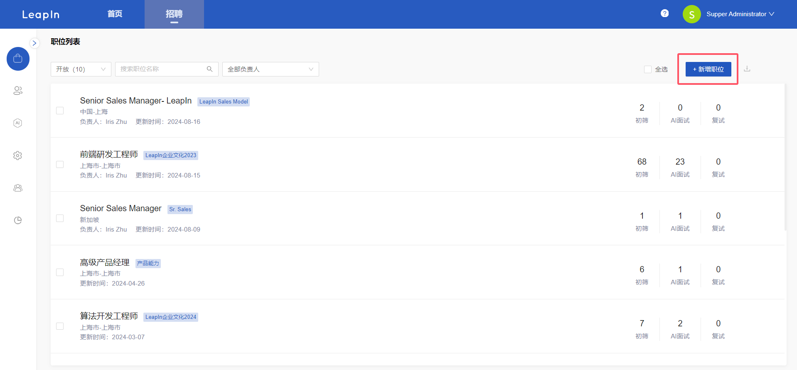
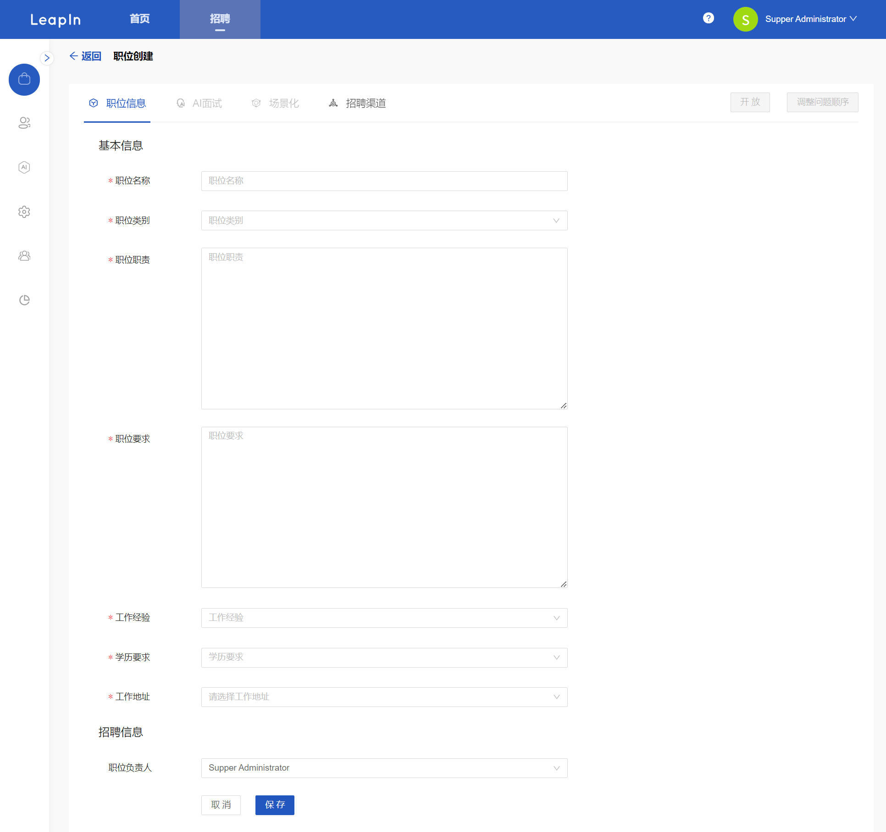
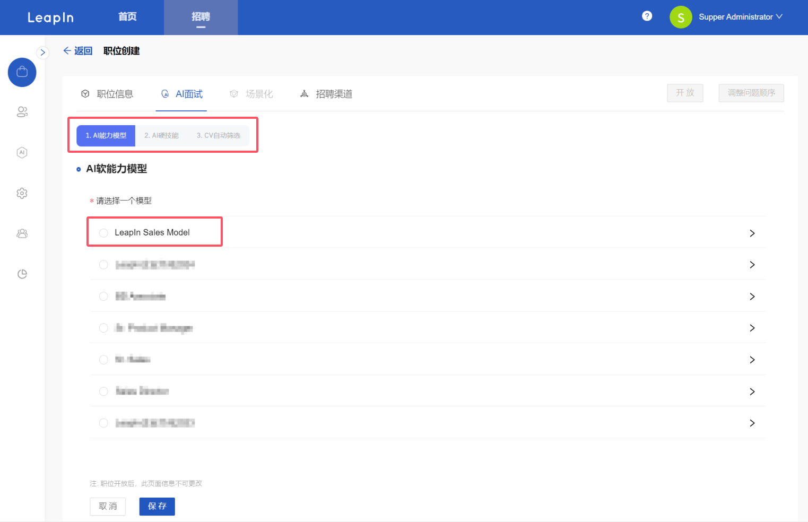
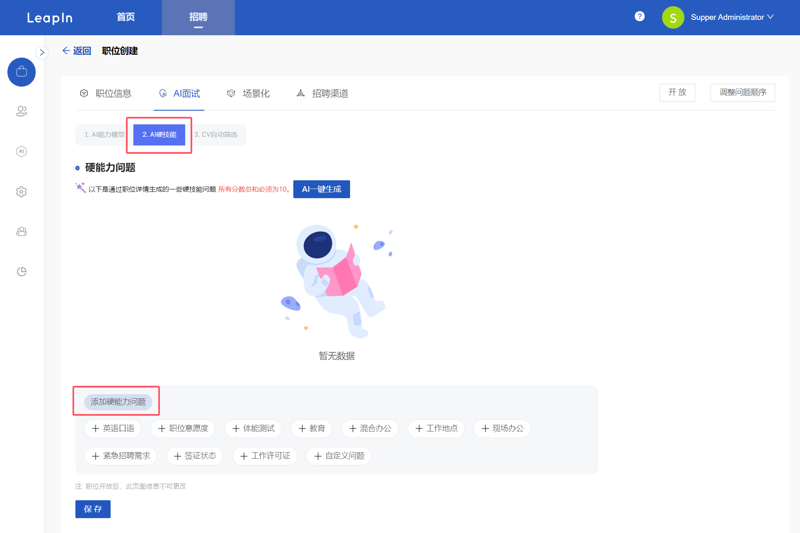
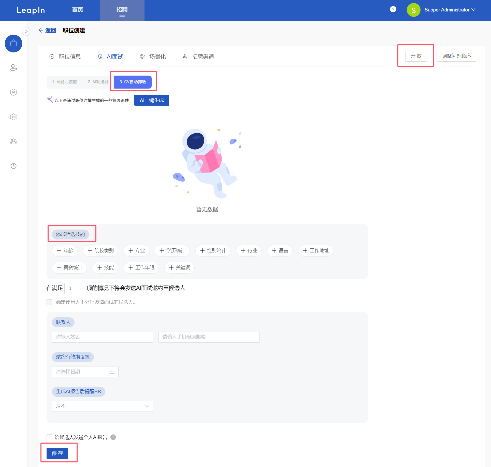
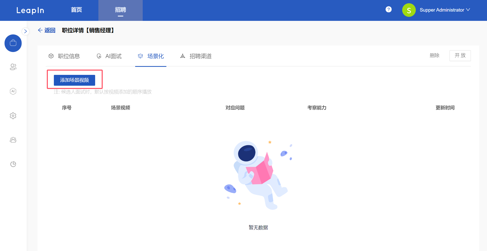
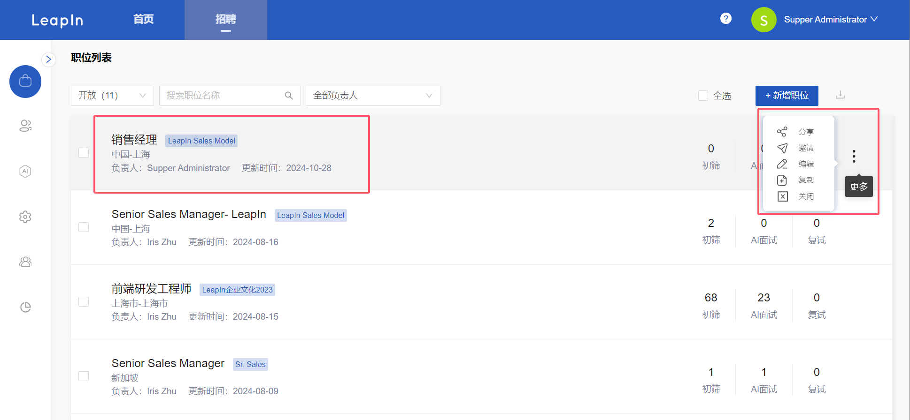

# 职位管理

### 新增职位流程

点击【职位列表】菜单，进入列表页面，点击右上角【新增职位】。

填写基本信息创建职位详情，填写信息后点击保存进入下一步。

进入AI面试设置，第一步选择AI 能力模型，点击【保存】后进入第二步，

设置AI硬技能，AI一键生成或手动添加，点击【保存】进入第三步设置CV自动筛选，

设置CV筛选条件，点击【保存】后完成设置（满足条件的候选人可自动发送AI面试邀约），点击【开放】完成职位创建，可邀约候选人参加面试如需添加场景化视频可至场景化板块添加，

在职位列表即可看到新建职位，可进行邀请候选人、编辑等一系列操作。

