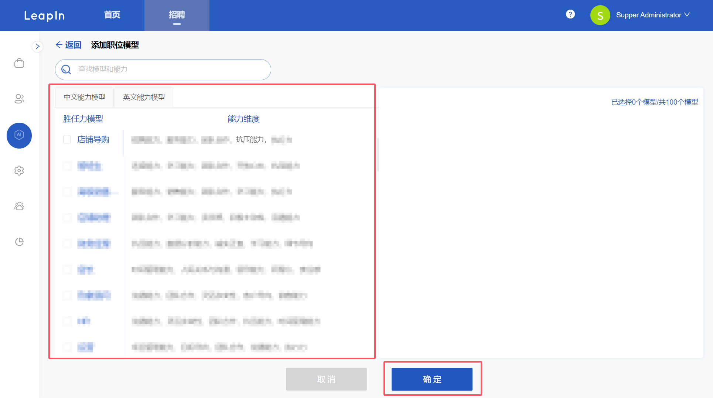
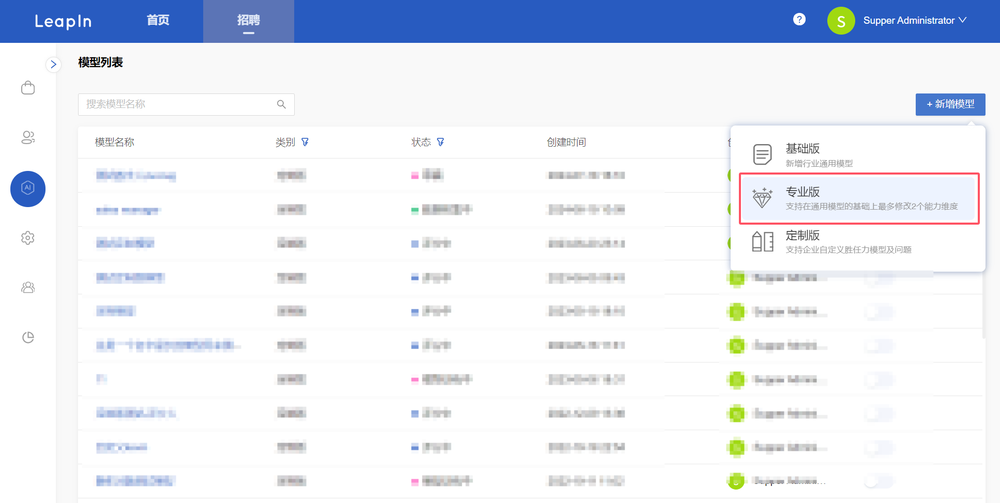
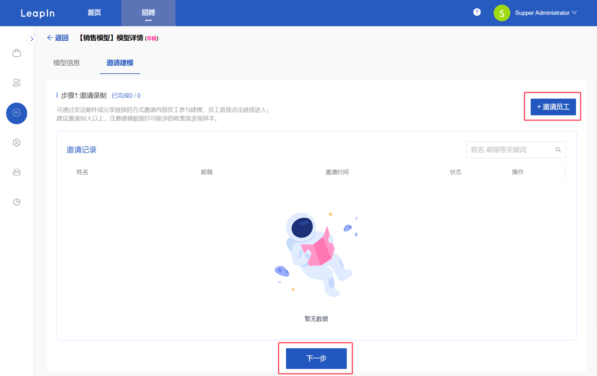
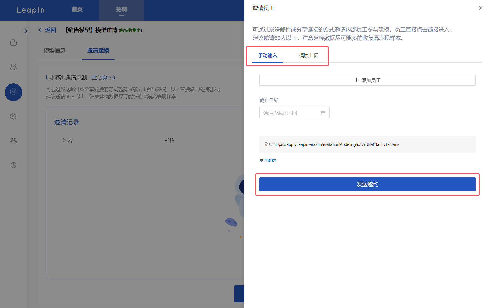
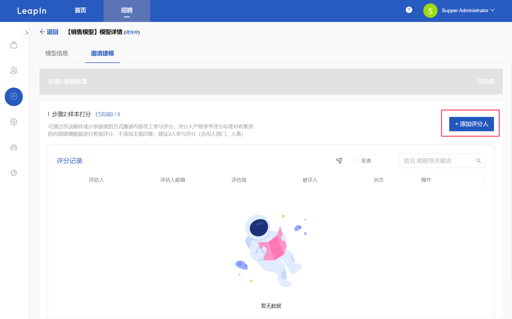
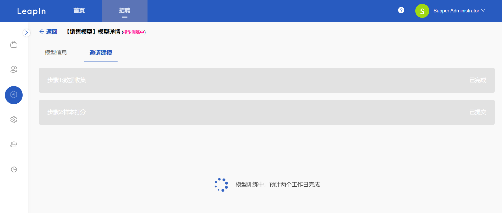

# 创建岗位模型

### 基础版

点击菜单模型管理，进入模型列表，点击右上角【新增模型】按钮

选择模型

在题库内选择预设好的模型，点击确定后模型直接上线。

### 专业版

点击菜单模型管理，进入模型列表，点击右上角【新增模型】按钮

选择模型

在模型详情可以选择和更改能力及问题，编辑完成点击确定后模型直接上线。

### 定制版

点击菜单模型管理，进入模型列表，点击右上角【新增模型】按钮

选择模型

输入模型名，添加/自定义能力和问题，建议4～6个问题，点击保存。

点击邀请按钮后弹出邀请页面，可以选择手动输入，也可以模版上传，输入完成后发送邀约，会发送邮件给被邀请人进行视频录制，以帮助建模。也可以复制链接发送到群里邀请。

在评分阶段，点击【添加评分人】可添加不同的评分小组进行评分，

完成评分后点击提交训练，进行后续的模型训练。

